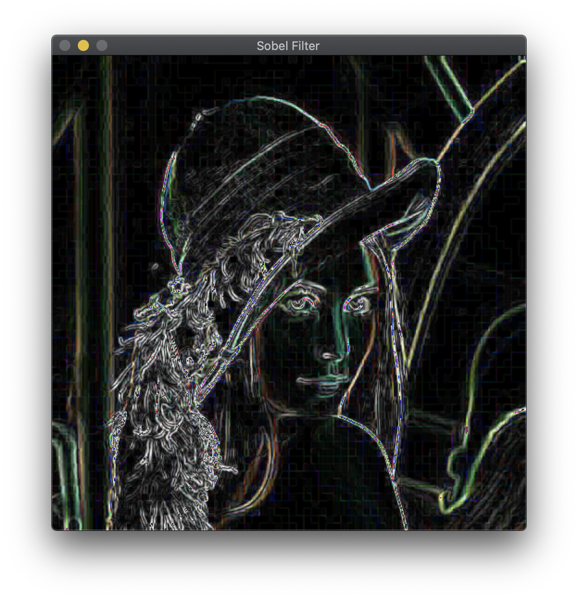
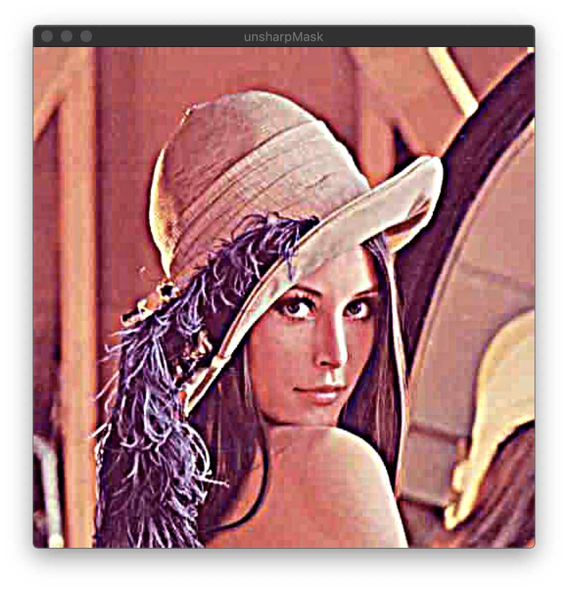

# Region

## Uniform Mean Filter

- MeanFilterGray.cpp
- MeanFilterRGB.cpp

To use, place your image in the same directory with exec files.

The purpose of this code is to apply a Mean Filter, a kind of low-pass filter to the image.

```Mat meanfilter (const Mat input, int n, const char * opt)```: parameters are input image, kernel sizing, and border processing option in order. The border processing method can be selected from zero-paddle, mirroring, and adjustkernel and entered as a string.


<br>

## Gaussian Filter

- GaussianGray.cpp
- GaussianRGB.cpp

To use, place your image in the same directory with exec files.

The purpose of this source code is to apply a Gaussian Filter, a low pass filter to the image. 

```Mat gaussianfilter (const Mat input, int n, float sigmaT, float sigmaS, const char * opt)```: parameters are input image, kernel size, two sigma in Gaussian expression, boundary processing option. The boundary processing method can be selected from zero-paddle, mirroring and adjustkernel and entered as a string.


<br>

## Sobel Filter

- SobelGray.cpp
- SobleRGB.cpp

To use, place your image in the same directory with exec files.

This source code is intended to apply Sobel Filter, a high pass filter to the image. In conclusion, it emphasizes the edge portion of the image whose intensity changes. In this process, the “mirroring” method is used to handle the border of the image. 

```Mat sobelfilter (const Mat input)``` 




<br>

## Laplacian Filter

- LaplacianGray.cpp
- LaplacianRGB.cpp

To use, place your image in the same directory with exec files.

This source code is intended to apply a high pass filter, Laplacian Filter, to an image. In conclusion, it emphasizes the edge portion of the image whose intensity changes. In this process, the “mirroring” method is used to handle the border of the image. 

```Mat laplacianfilter (const Mat input)```


<br>

## Laplacian of Gaussian(LoG)

- LaplacianGaussianGray.cpp
- LaplacianGaussianRGB.cpp

To use, place your image in the same directory with exec files.

This source code is intended to apply a high pass filter, Laplacian Filter, to an image. But, Laplacian filter is sensitive to noise. Therefore, in this code a low-pass filter, a Gaussian filter is applied first before apply laplacian.


<br>

## Seperable Gaussian Filter

- GaussianSepGray.cpp
- GaussianSepRGB.cpp

To use, place your image in the same directory with exec files.

The purpose of this source code is to apply a Gaussian Filter, a low pass filter to the image. Also, in this process, filter is applied by dividing it twice so that the operation can be performed more quickly. (Cascade connection) Mirroring is used as a method to process the boundary line. Result and parameters of the function are the same as the Gaussian Filter described above, so they are omitted.

<br>

## Unsharp Masking

- UnsharpMaskingGray.cpp
- UnsharpMaskingRGB.cpp

To use, place your image in the same directory with exec files.

This source code aims to make the image more sharp Therefore, the image with the low-pass filter applied is subtracted from the original image. In this code, it uses the gaussian filter as a low-pass filter.

```unsharpMask (const Mat input, int n, float sigmaT, float sigmaS, const char * opt, float k)```: Parameters except for k are the same as Gaussian Filter described above, so they are omitted. The last parameter, k, is a constant used to scale the low-pass filter. That is, output = (1-kL) / (1-k) and L = the image applied low-pass filter.

